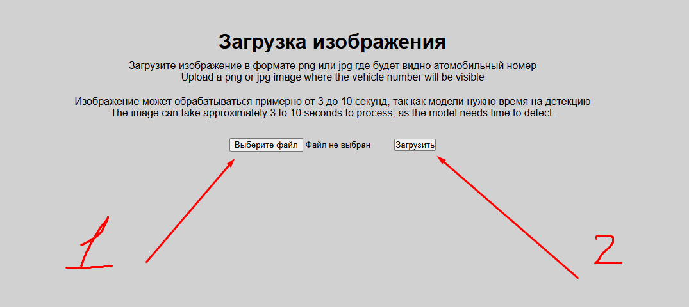
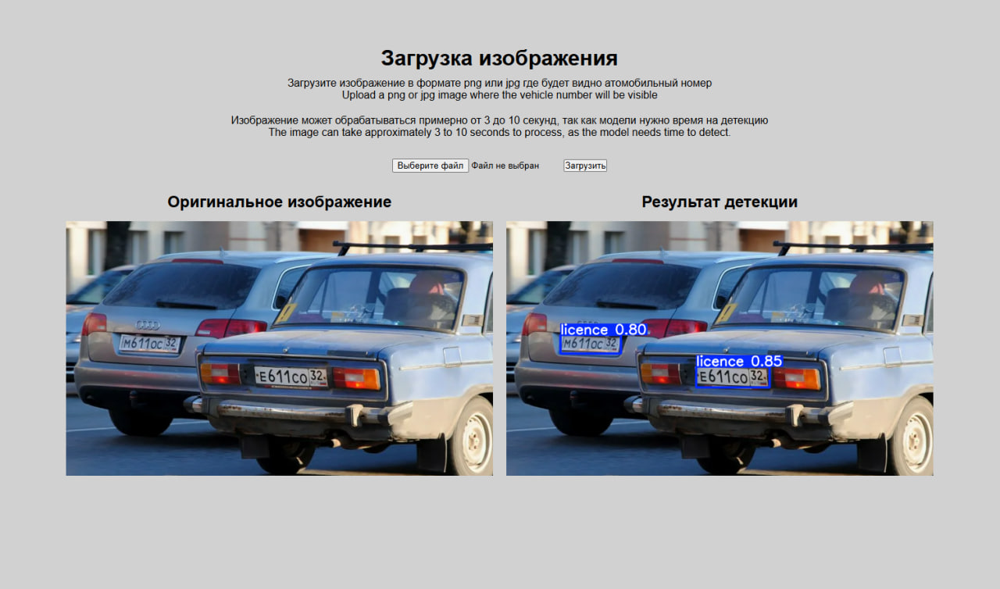
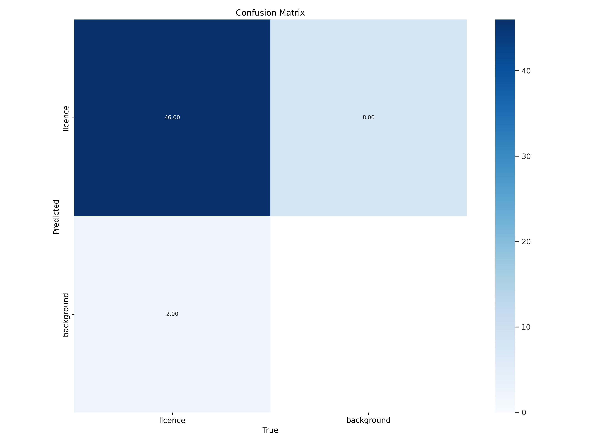
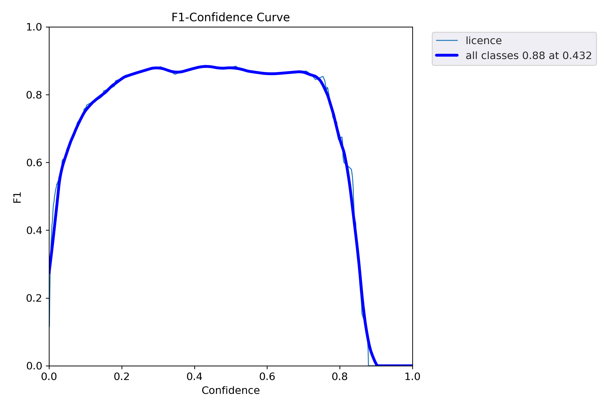

# CV_car_number_plate_detection

The project CV_car_number_plate_detection is a solution for detecting car license plates using computer vision methods. The primary goal of the project is automatic recognition of vehicle registration numbers in images and video streams.

## Main components of the project:
* **Detection algorithm:** The OpenCV library is used for image preprocessing, along with machine learning algorithms to highlight areas containing license plates.
* **Image processing:** Methods such as noise reduction, contrast enhancement, and color transformation are applied to improve detection accuracy.
* **Character recognition:** After isolating the number plate area, Optical Character Recognition (OCR) techniques are employed to accurately identify the characters of the vehicle's registration mark.
* **Model integration:** The project allows integrating various deep learning models to increase both precision and speed of recognition.

## Capabilities and applications:
* **Automated parking systems:** Fast and accurate identification of license plates helps optimize paid parking lots and automated parking facilities.
* **Security system:** Detection and identification of vehicles can be utilized for traffic control and preventing road violations.
* **Traffic management:** Automated vehicle tracking simplifies traffic flow management and data collection.


## Project structure

```
CV_CAR_NUMBER_PLATE_DETECTION/
│
├── data                     # Project Data
│   ├── annotations          # Annotation files (*.xml)
│   │   └── *.xml
│   └── images               # Images
│       └── *.png
├── runs                      # Run Results
│   ├── weights              # Model Weights (*.pt)
│   │   └── *.pt
│   ├── *.csv                # Final predictions in CSV format
│   ├── *.png                # Visualization graphics
│   └── *.yaml               # Configuration YAML files
├── yolo                     # Folder for YOLO-related data
│   ├── images               # Separate sets of images
│   │   ├── train            # Training images
│   │   │   └── *.png
│   │   └── val              # Validation images
│   │       └── *.png
│   ├── labels               # Text annotation files
│   │   ├── train            # Labels for training set
│   │   │   └── *.txt
│   │   └── val              # Labels for validation set
│   │       └── *.txt
│   └── dataset.yaml         # Dataset configuration file
├── yolov5                   # Repository for YOLOv5 (https://github.com/ultralytics/yolov5)
│   └── repository
├── car.ipynb                # Main Jupyter notebook with code
├── .gitignore               # Files ignored by Git
├── readme.md                # Documentation
├── requirements.txt         # Requirements for Python packages
└── yolov5_predictions.csv   # Final prediction output file
```

## Libraries and the learning process

This repository is dedicated to the task of automatically recognizing vehicle registration plates using computer vision methods. The following ***[libraries](https://github.com/esta1d/CV_car_number_plate_detection/blob/main/requirements.txt)*** were used in the project.

The solution to this case can be found ***[here](https://github.com/esta1d/CV_car_number_plate_detection/blob/main/car.ipynb)***.

The project also has a deployment on a server where you can upload an image and see the model's output. ***[Server link](http://64.188.99.24:5001/)***.

## Web application for checking the model

To check the functionality of the model, follow the link above. The following page will open:

> Please pay attention to the fact that the page does not have a certificate, so the browser will complain that the page is not `HTTPS`



Click on choose file and upload it. The form accepts png jpg files only. Uploading an image and processing the image by the model takes on average 5 seconds.

### Model output



## Learning Metrics

### confusion_matrix


### F1_curve


## General links

* ***[Solution](https://github.com/esta1d/CV_car_number_plate_detection/blob/main/car.ipynb)***
* ***[Libraries](https://github.com/esta1d/CV_car_number_plate_detection/blob/main/requirements.txt)***
* ***[Repository] ultralytics/yolov5 (https://github.com/ultralytics/yolov5)***
* ***[Web application](http://64.188.99.24:5001/) (for demonstrating the model)***

## Conclusion
The CV_car_number_plate_detection project provides a versatile solution for automatic vehicle license plate recognition, which can be adapted for various tasks related to transportation and security. We hope that this project will become a useful tool for developers and researchers working in the fields of computer vision and machine learning.